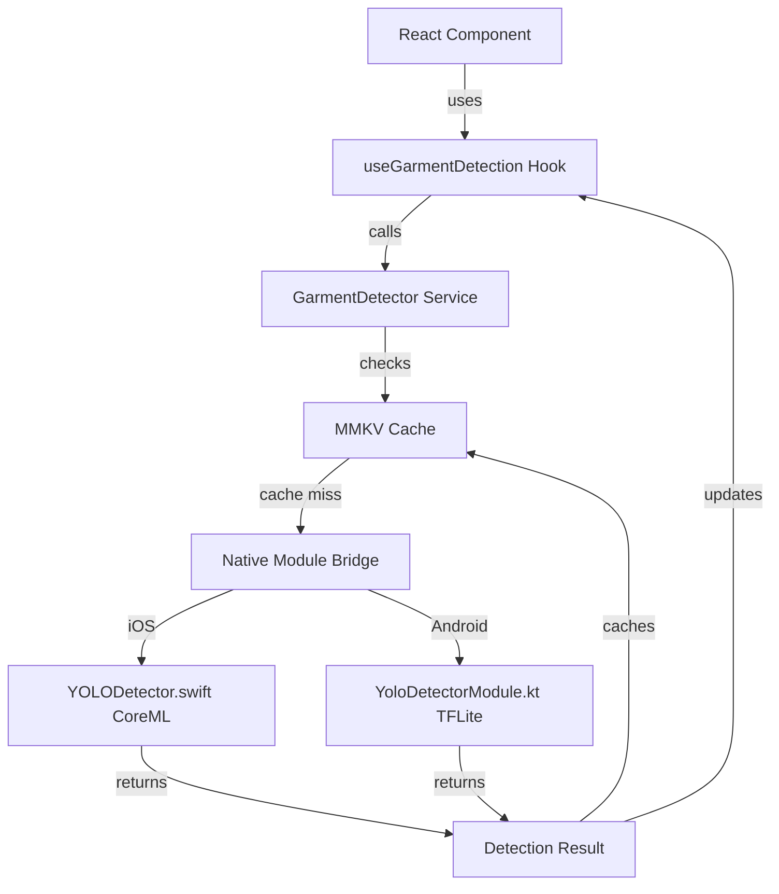

# YOLOv8n Mobile Garment Detection - Implementation Plan

## Overview

Implement a complete on-device garment detection module for the Wardrobe React Native app using YOLOv8n trained on DeepFashion2 dataset. This includes model training, export to mobile formats (CoreML/TFLite), native modules for both iOS and Android, TypeScript service layer with MMKV caching, and React hooks for easy integration.

**Key Configuration**:

- **React Native Version**: 0.80.2
- **Storage**: MMKV (already installed)
- **Categories**: 6 garments (top, bottom, shoes, dress, outerwear, accessory)
- **Android Package**: Will update from `com.boilerplate` to `com.wardrobe`
- **Training Dataset**: DeepFashion2 (491K images)
- **Model Architecture**: YOLOv8n (optimized for mobile, 320x320 input)

## Quick Start Guide

### Complete Implementation Timeline: 10-16 hours

1. **Phase 0: Model Training** (6-10 hours)

   - Download DeepFashion2 dataset
   - Train YOLOv8n on Google Colab (free GPU)
   - Export to CoreML (.mlmodel) and TFLite (.tflite)

2. **Phase 1-2: TypeScript Layer** (2 hours)

   - Types, config, service with MMKV
   - React hooks and test screen

3. **Phase 3-4: Native Modules** (2-3 hours)

   - iOS: Swift + CoreML integration
   - Android: Kotlin + TFLite integration

4. **Phase 5-6: Testing & Docs** (1 hour)

   - Unit tests
   - Documentation

**Fastest Path**: Use pre-converted DeepFashion2 from Roboflow + train on Colab → 6 hours total

## Architecture



## Implementation Steps

### Phase 0: Model Training with DeepFashion2 (PREREQUISITE)

This phase prepares and trains the YOLOv8n model using the DeepFashion2 dataset. **Complete this phase before implementing the mobile modules.**

#### 0.1 Environment Setup

**Create Training Environment:**

```bash
# Create project directory
mkdir yolo-fashion-training
cd yolo-fashion-training

# Create virtual environment
python3 -m venv venv
source venv/bin/activate  # On Windows: venv\Scripts\activate

# Install dependencies
pip install ultralytics roboflow supervision pillow
```

**Verify Installation:**

```bash
yolo task=detect mode=predict model=yolov8n.pt source='https://ultralytics.com/images/bus.jpg'
```

#### 0.2 DeepFashion2 Dataset Preparation

**Option A: Direct Download (Recommended)**

```bash
# Download DeepFashion2 dataset
# Visit: https://github.com/switchablenorms/DeepFashion2
# Register and download the dataset (requires form submission)

# Expected structure after extraction:
# deepfashion2/
# ├── train/
# │   ├── image/
# │   └── annos/
# └── validation/
#     ├── image/
#     └── annos/
```

**Option B: Use Roboflow (Faster - Pre-converted)**

```bash
# Install Roboflow
pip install roboflow

# Python script to download
python << EOF
from roboflow import Roboflow

rf = Roboflow(api_key="YOUR_API_KEY")  # Get from roboflow.com
project = rf.workspace("fashion-detection").project("deepfashion2-yolo")
dataset = project.version(1).download("yolov8")
EOF
```

#### 0.3 Data Conversion Script

Create `convert_deepfashion2.py`:

```python
import json
import os
import shutil
from pathlib import Path
from PIL import Image

# Category mapping to our 6 classes
CATEGORY_MAPPING = {
    'short sleeve top': 0,          # top
    'long sleeve top': 0,           # top
    'short sleeve outwear': 4,      # outerwear
    'long sleeve outwear': 4,       # outerwear
    'vest': 0,                      # top
    'sling': 0,                     # top
    'shorts': 1,                    # bottom
    'trousers': 1,                  # bottom
    'skirt': 1,                     # bottom
    'short sleeve dress': 3,        # dress
    'long sleeve dress': 3,         # dress
    'vest dress': 3,                # dress
    'sling dress': 3,               # dress
}

CLASSES = ['top', 'bottom', 'shoes', 'dress', 'outerwear', 'accessory']

def convert_deepfashion2_to_yolo(source_dir, output_dir):
    """Convert DeepFashion2 annotations to YOLO format"""
    
    os.makedirs(f'{output_dir}/images/train', exist_ok=True)
    os.makedirs(f'{output_dir}/images/val', exist_ok=True)
    os.makedirs(f'{output_dir}/labels/train', exist_ok=True)
    os.makedirs(f'{output_dir}/labels/val', exist_ok=True)
    
    for split in ['train', 'validation']:
        yolo_split = 'train' if split == 'train' else 'val'
        anno_dir = f'{source_dir}/{split}/annos'
        image_dir = f'{source_dir}/{split}/image'
        
        for anno_file in Path(anno_dir).glob('*.json'):
            with open(anno_file) as f:
                data = json.load(f)
            
            image_name = anno_file.stem + '.jpg'
            image_path = f'{image_dir}/{image_name}'
            
            if not os.path.exists(image_path):
                continue
            
            # Get image dimensions
            img = Image.open(image_path)
            img_width, img_height = img.size
            
            yolo_annotations = []
            
            for item_key, item_data in data.items():
                if item_key == 'source':
                    continue
                
                category = item_data.get('category_name', '')
                
                if category not in CATEGORY_MAPPING:
                    continue
                
                class_id = CATEGORY_MAPPING[category]
                bbox = item_data.get('bounding_box', [])
                
                if len(bbox) != 4:
                    continue
                
                x1, y1, x2, y2 = bbox
                
                # Convert to YOLO format (normalized center x, y, width, height)
                x_center = ((x1 + x2) / 2) / img_width
                y_center = ((y1 + y2) / 2) / img_height
                width = (x2 - x1) / img_width
                height = (y2 - y1) / img_height
                
                # Validate bounds
                if all(0 <= v <= 1 for v in [x_center, y_center, width, height]):
                    yolo_annotations.append(f'{class_id} {x_center} {y_center} {width} {height}')
            
            if yolo_annotations:
                # Copy image
                shutil.copy(
                    image_path,
                    f'{output_dir}/images/{yolo_split}/{image_name}'
                )
                
                # Write label file
                label_path = f'{output_dir}/labels/{yolo_split}/{anno_file.stem}.txt'
                with open(label_path, 'w') as f:
                    f.write('\n'.join(yolo_annotations))
    
    # Create data.yaml
    yaml_content = f"""
train: ./images/train
val: ./images/val

nc: 6
names: {CLASSES}
"""
    
    with open(f'{output_dir}/data.yaml', 'w') as f:
        f.write(yaml_content)
    
    print(f'Conversion complete! Dataset saved to {output_dir}')

if __name__ == '__main__':
    convert_deepfashion2_to_yolo(
        source_dir='./deepfashion2',
        output_dir='./deepfashion2_yolo'
    )
```

**Run Conversion:**

```bash
python convert_deepfashion2.py
```

#### 0.4 Training Configuration

Create `train_yolo.py`:

```python
from ultralytics import YOLO
import torch

def train_garment_detector():
    # Check GPU availability
    device = 0 if torch.cuda.is_available() else 'cpu'
    print(f"Training on: {'GPU' if device == 0 else 'CPU'}")
    
    # Load pre-trained YOLOv8n
    model = YOLO('yolov8n.pt')
    
    # Training hyperparameters optimized for mobile deployment
    results = model.train(
        data='deepfashion2_yolo/data.yaml',
        epochs=100,
        imgsz=320,  # Mobile-optimized input size
        batch=32,   # Adjust based on GPU memory
        device=device,
        
        # Optimization settings
        patience=20,  # Early stopping
        save=True,
        save_period=10,  # Save checkpoint every 10 epochs
        
        # Augmentation (built-in)
        hsv_h=0.015,      # Hue augmentation
        hsv_s=0.7,        # Saturation
        hsv_v=0.4,        # Value/brightness
        degrees=10,       # Rotation
        translate=0.1,    # Translation
        scale=0.5,        # Scale
        flipud=0.0,       # No vertical flip
        fliplr=0.5,       # Horizontal flip 50%
        mosaic=1.0,       # Mosaic augmentation
        mixup=0.1,        # Mixup augmentation
        
        # Performance
        optimizer='AdamW',
        lr0=0.001,        # Initial learning rate
        lrf=0.01,         # Final learning rate
        momentum=0.937,
        weight_decay=0.0005,
        warmup_epochs=3,
        
        # Model size optimization
        amp=True,         # Automatic mixed precision (faster)
        
        # Logging
        project='runs/detect',
        name='yolov8n_fashion',
        exist_ok=True,
        
        # Validation
        val=True,
        plots=True,       # Save training plots
    )
    
    return model

if __name__ == '__main__':
    model = train_garment_detector()
    print("Training complete!")
    print(f"Best model: runs/detect/yolov8n_fashion/weights/best.pt")
```

**Run Training:**

```bash
# Start training (takes 4-8 hours on GPU, 1-2 days on CPU)
python train_yolo.py
```

**Expected Training Metrics:**

- **mAP@0.5**: >0.75 (good for mobile)
- **mAP@0.5:0.95**: >0.50
- **Precision**: >0.80
- **Recall**: >0.70

#### 0.5 Model Evaluation

Create `evaluate_model.py`:

```python
from ultralytics import YOLO
import cv2
from pathlib import Path

def evaluate_model(model_path='runs/detect/yolov8n_fashion/weights/best.pt'):
    model = YOLO(model_path)
    
    # Validate on test set
    metrics = model.val(data='deepfashion2_yolo/data.yaml')
    
    print(f"mAP@0.5: {metrics.box.map50}")
    print(f"mAP@0.5:0.95: {metrics.box.map}")
    print(f"Precision: {metrics.box.p}")
    print(f"Recall: {metrics.box.r}")
    
    # Test on sample images
    results = model.predict(
        source='deepfashion2_yolo/images/val',
        save=True,
        conf=0.7,
        max_det=10,
        project='runs/detect',
        name='validation_results'
    )
    
    print(f"\nResults saved to: runs/detect/validation_results/")

if __name__ == '__main__':
    evaluate_model()
```

#### 0.6 Export to Mobile Formats

Create `export_model.py`:

```python
from ultralytics import YOLO
import coremltools as ct  # pip install coremltools

def export_to_mobile_formats(model_path='runs/detect/yolov8n_fashion/weights/best.pt'):
    model = YOLO(model_path)
    
    print("Exporting to CoreML (iOS)...")
    # Export to CoreML
    model.export(
        format='coreml',
        imgsz=320,
        nms=True,  # Include NMS in model
        half=False,  # Full precision for better accuracy
    )
    
    print("Exporting to TFLite (Android)...")
    # Export to TFLite
    model.export(
        format='tflite',
        imgsz=320,
        int8=False,  # Use float16 for better accuracy
        data='deepfashion2_yolo/data.yaml',
    )
    
    print("\n✅ Export complete!")
    print(f"CoreML model: {model_path.replace('.pt', '.mlpackage')}")
    print(f"TFLite model: {model_path.replace('.pt', '_saved_model')}/best_float16.tflite")
    
    return model

if __name__ == '__main__':
    export_to_mobile_formats()
```

**Run Export:**

```bash
# Install CoreML tools (macOS only for iOS export)
pip install coremltools

# Export models
python export_model.py
```

#### 0.7 Model Files Integration

After exporting, move models to mobile project:

**iOS (CoreML):**

```bash
# Find the exported CoreML model
cp runs/detect/yolov8n_fashion/weights/best.mlpackage/Data/com.apple.CoreML/model.mlmodel \
   ../template/ios/Models/yolov8n_fashion.mlmodel

# Or if it exports as .mlpackage directly:
# You'll need to extract the .mlmodel from inside the .mlpackage bundle
```

**Android (TFLite):**

```bash
# Copy TFLite model
cp runs/detect/yolov8n_fashion/weights/best_saved_model/best_float16.tflite \
   ../template/android/app/src/main/assets/yolov8n_fashion.tflite
```

#### 0.8 Training on Cloud (Google Colab - Free GPU)

Create `train_colab.ipynb`:

```python
# Cell 1: Install dependencies
!pip install ultralytics roboflow

# Cell 2: Download dataset
from roboflow import Roboflow
rf = Roboflow(api_key="YOUR_API_KEY")
project = rf.workspace("fashion").project("deepfashion2-yolo")
dataset = project.version(1).download("yolov8")

# Cell 3: Train
from ultralytics import YOLO
model = YOLO('yolov8n.pt')
results = model.train(
    data=f'{dataset.location}/data.yaml',
    epochs=100,
    imgsz=320,
    batch=32,
    device=0,
)

# Cell 4: Export
model.export(format='coreml', imgsz=320)
model.export(format='tflite', imgsz=320)

# Cell 5: Download models
from google.colab import files
files.download('runs/detect/train/weights/best.mlmodel')
files.download('runs/detect/train/weights/best_saved_model/best_float16.tflite')
```

**Upload to Colab**: [colab.research.google.com](https://colab.research.google.com)

#### 0.9 Quick Start Summary

**Fastest Path (Using Roboflow):**

1. **Setup** (5 mins):
   ```bash
   pip install ultralytics roboflow
   ```

2. **Download Dataset** (10 mins):
   ```python
   from roboflow import Roboflow
   rf = Roboflow(api_key="YOUR_KEY")
   dataset = rf.workspace("fashion").project("clothing-detection").version(1).download("yolov8")
   ```

3. **Train** (4-8 hours on Colab GPU):
   ```python
   from ultralytics import YOLO
   model = YOLO('yolov8n.pt')
   model.train(data=f'{dataset.location}/data.yaml', epochs=100, imgsz=320)
   ```

4. **Export** (2 mins):
   ```python
   model.export(format='coreml', imgsz=320)
   model.export(format='tflite', imgsz=320)
   ```

5. **Move Models** to React Native project directories

**Timeline**: ~6-10 hours total (mostly training time)

---

### Phase 1: TypeScript Foundation (Template Directory)

All TypeScript files will be created in [`template/src/`](template/src/).

#### 1.1 Detection Types ([`template/src/types/detection.types.ts`](template/src/types/detection.types.ts))

Create TypeScript interfaces for garment detection:

```typescript
export enum GarmentCategory {
  TOP = 'top',
  BOTTOM = 'bottom',
  SHOES = 'shoes',
  DRESS = 'dress',
  OUTERWEAR = 'outerwear',
  ACCESSORY = 'accessory',
}

export interface BoundingBox {
  x: number;
  y: number;
  width: number;
  height: number;
}

export interface Detection {
  category: GarmentCategory;
  confidence: number; // 0.0 - 1.0
  bbox: BoundingBox;
  alternativePredictions?: Array<{
    category: GarmentCategory;
    confidence: number;
  }>;
}

export interface DetectionResult {
  detection: Detection;
  processingTimeMs: number;
  timestamp: number;
  imageUri: string;
}
```

#### 1.2 Detection Config ([`template/src/config/detection.config.ts`](template/src/config/detection.config.ts))

Configuration for model behavior:

```typescript
export const DETECTION_CONFIG = {
  // Model classes (must match training order)
  categories: ['top', 'bottom', 'shoes', 'dress', 'outerwear', 'accessory'] as const,
  
  // Confidence threshold
  confidenceThreshold: 0.7,
  
  // Cache TTL (7 days in milliseconds)
  cacheTTLMs: 7 * 24 * 60 * 60 * 1000,
  
  // Input image size (must match model)
  inputSize: 320,
  
  // NMS threshold (Android only)
  nmsThreshold: 0.5,
  
  // MMKV storage key prefix
  cacheKeyPrefix: '@garment_detection:',
} as const;
```

#### 1.3 Service Layer ([`template/src/services/GarmentDetector.ts`](template/src/services/GarmentDetector.ts))

Singleton service with caching using MMKV (already in project at [`template/src/services/instance.ts`](template/src/services/instance.ts)):

```typescript
import { NativeModules } from 'react-native';
import { MMKV } from 'react-native-mmkv';
import { DetectionResult, Detection } from '@/types/detection.types';
import { DETECTION_CONFIG } from '@/config/detection.config';

const { YOLODetector } = NativeModules;

class GarmentDetectorService {
  private storage: MMKV;
  
  constructor() {
    this.storage = new MMKV({ id: 'garment-detection' });
    this.checkNativeModule();
  }
  
  private checkNativeModule(): void {
    if (!YOLODetector) {
      console.error('YOLODetector native module not found');
    }
  }
  
  private getCacheKey(imageUri: string): string {
    return `${DETECTION_CONFIG.cacheKeyPrefix}${imageUri}`;
  }
  
  private async getCached(imageUri: string): Promise<DetectionResult | null> {
    const key = this.getCacheKey(imageUri);
    const cached = this.storage.getString(key);
    
    if (!cached) return null;
    
    const result = JSON.parse(cached) as DetectionResult;
    const isExpired = Date.now() - result.timestamp > DETECTION_CONFIG.cacheTTLMs;
    
    if (isExpired) {
      this.storage.delete(key);
      return null;
    }
    
    return result;
  }
  
  private cache(imageUri: string, result: DetectionResult): void {
    const key = this.getCacheKey(imageUri);
    this.storage.set(key, JSON.stringify(result));
  }
  
  async detectGarment(imageUri: string, useCache: boolean = true): Promise<DetectionResult> {
    // Check cache first
    if (useCache) {
      const cached = await this.getCached(imageUri);
      if (cached) {
        return { ...cached, fromCache: true };
      }
    }
    
    // Call native module
    const startTime = Date.now();
    const detection: Detection = await YOLODetector.detectGarment(imageUri);
    const processingTimeMs = Date.now() - startTime;
    
    const result: DetectionResult = {
      detection,
      processingTimeMs,
      timestamp: Date.now(),
      imageUri,
    };
    
    // Cache result
    if (useCache) {
      this.cache(imageUri, result);
    }
    
    return result;
  }
  
  clearCache(): void {
    this.storage.clearAll();
  }
}

export const GarmentDetector = new GarmentDetectorService();
```

#### 1.4 React Hook ([`template/src/hooks/domain/useGarmentDetection.ts`](template/src/hooks/domain/useGarmentDetection.ts))

Custom hook following project pattern (other domain hooks exist):

```typescript
import { useState, useCallback } from 'react';
import { GarmentDetector } from '@/services/GarmentDetector';
import { DetectionResult } from '@/types/detection.types';

export function useGarmentDetection() {
  const [result, setResult] = useState<DetectionResult | null>(null);
  const [loading, setLoading] = useState(false);
  const [error, setError] = useState<Error | null>(null);

  const detect = useCallback(async (imageUri: string, useCache = true) => {
    setLoading(true);
    setError(null);
    try {
      const detection = await GarmentDetector.detectGarment(imageUri, useCache);
      setResult(detection);
      return detection;
    } catch (err) {
      const error = err instanceof Error ? err : new Error('Detection failed');
      setError(error);
      throw error;
    } finally {
      setLoading(false);
    }
  }, []);

  const reset = useCallback(() => {
    setResult(null);
    setError(null);
  }, []);

  return {
    detect,
    result,
    loading,
    error,
    reset,
  };
}
```

Export from [`template/src/hooks/domain/index.ts`](template/src/hooks/domain/index.ts).

### Phase 2: iOS Native Module

#### 2.1 Swift Implementation ([`template/ios/YOLODetector.swift`](template/ios/YOLODetector.swift))

CoreML-based detection with Vision framework:

```swift
import Foundation
import CoreML
import Vision
import UIKit

@objc(YOLODetector)
class YOLODetector: NSObject {
    
    private var visionModel: VNCoreMLModel?
    private let categories = ["top", "bottom", "shoes", "dress", "outerwear", "accessory"]
    private let confidenceThreshold: Float = 0.7
    
    override init() {
        super.init()
        loadModel()
    }
    
    private func loadModel() {
        // TODO: Load yolov8n_fashion.mlmodel when provided
        // For now, log placeholder message
        NSLog("[YOLODetector] Model loading placeholder - add yolov8n_fashion.mlmodel to ios/Models/")
        
        // Uncomment when model is added:
        /*
        guard let modelURL = Bundle.main.url(forResource: "yolov8n_fashion", withExtension: "mlmodelc") else {
            NSLog("[YOLODetector] Model file not found")
            return
        }
        
        do {
            let mlModel = try MLModel(contentsOf: modelURL)
            self.visionModel = try VNCoreMLModel(for: mlModel)
            NSLog("[YOLODetector] Model loaded successfully")
        } catch {
            NSLog("[YOLODetector] Failed to load model: \(error)")
        }
        */
    }
    
    @objc
    func detectGarment(
        _ imageUri: String,
        resolver resolve: @escaping RCTPromiseResolveBlock,
        rejecter reject: @escaping RCTPromiseRejectBlock
    ) {
        // Placeholder implementation
        if visionModel == nil {
            reject("MODEL_NOT_LOADED", "YOLOv8n model not loaded. Add yolov8n_fashion.mlmodel to ios/Models/", nil)
            return
        }
        
        // Load image from URI
        guard let image = loadImage(from: imageUri) else {
            reject("INVALID_IMAGE", "Failed to load image from URI", nil)
            return
        }
        
        // Run inference (placeholder - will be implemented when model is added)
        let result: [String: Any] = [
            "category": "top",
            "confidence": 0.0,
            "bbox": [
                "x": 0,
                "y": 0,
                "width": 100,
                "height": 100
            ],
            "alternativePredictions": []
        ]
        
        resolve(result)
    }
    
    private func loadImage(from uriString: String) -> UIImage? {
        guard let url = URL(string: uriString) else { return nil }
        
        // Handle file:// URIs
        if url.scheme == "file" {
            guard let data = try? Data(contentsOf: url) else { return nil }
            return UIImage(data: data)
        }
        
        return nil
    }
    
    @objc
    static func requiresMainQueueSetup() -> Bool {
        return false
    }
}
```

#### 2.2 Objective-C Bridge ([`template/ios/YOLODetector.m`](template/ios/YOLODetector.m))

Bridge for React Native:

```objc
#import <React/RCTBridgeModule.h>

@interface RCT_EXTERN_MODULE(YOLODetector, NSObject)

RCT_EXTERN_METHOD(detectGarment:(NSString *)imageUri
                  resolver:(RCTPromiseResolveBlock)resolve
                  rejecter:(RCTPromiseRejectBlock)reject)

@end
```

#### 2.3 Model Directory Structure

Create directory: `template/ios/Models/` with README:

```markdown
# YOLO Models Directory

Place your trained YOLOv8n CoreML model here:

- `yolov8n_fashion.mlmodel`

After adding the model:
1. Open Xcode
2. Add the model to the Boilerplate target
3. Ensure it's in "Copy Bundle Resources"
```

### Phase 3: Android Native Module

#### 3.1 Update Package Name

**Files to update**:

- [`template/android/app/src/main/java/com/boilerplate/MainActivity.kt`](template/android/app/src/main/java/com/boilerplate/MainActivity.kt)
- [`template/android/app/src/main/java/com/boilerplate/MainApplication.kt`](template/android/app/src/main/java/com/boilerplate/MainApplication.kt)
- [`template/android/app/build.gradle`](template/android/app/build.gradle) (applicationId)
- [`template/android/app/src/main/AndroidManifest.xml`](template/android/app/src/main/AndroidManifest.xml)

Rename package from `com.boilerplate` to `com.wardrobe`.

#### 3.2 Add TFLite Dependencies ([`template/android/app/build.gradle`](template/android/app/build.gradle))

Add to dependencies block:

```gradle
dependencies {
    // ... existing dependencies ...
    
    // TensorFlow Lite for YOLO detection
    implementation 'org.tensorflow:tensorflow-lite:2.13.0'
    implementation 'org.tensorflow:tensorflow-lite-support:0.4.4'
    implementation 'org.tensorflow:tensorflow-lite-gpu:2.13.0' // Optional: GPU acceleration
}
```

#### 3.3 Kotlin Module ([`template/android/app/src/main/java/com/wardrobe/YoloDetectorModule.kt`](template/android/app/src/main/java/com/wardrobe/YoloDetectorModule.kt))

```kotlin
package com.wardrobe

import android.graphics.Bitmap
import android.graphics.BitmapFactory
import android.net.Uri
import com.facebook.react.bridge.*
import org.tensorflow.lite.Interpreter
import org.tensorflow.lite.support.common.FileUtil
import java.nio.ByteBuffer
import java.nio.ByteOrder

class YoloDetectorModule(reactContext: ReactApplicationContext) : ReactContextBaseJavaModule(reactContext) {
    
    private var interpreter: Interpreter? = null
    private val categories = listOf("top", "bottom", "shoes", "dress", "outerwear", "accessory")
    private val inputSize = 320
    private val confidenceThreshold = 0.7f
    
    override fun getName(): String = "YOLODetector"
    
    init {
        loadModel()
    }
    
    private fun loadModel() {
        // TODO: Load yolov8n_fashion.tflite when provided
        // Placeholder implementation
        try {
            // Uncomment when model is added:
            /*
            val modelBuffer = FileUtil.loadMappedFile(reactApplicationContext, "yolov8n_fashion.tflite")
            val options = Interpreter.Options().apply {
                setNumThreads(4)
                setUseNNAPI(true) // Hardware acceleration
            }
            interpreter = Interpreter(modelBuffer, options)
            */
        } catch (e: Exception) {
            // Model not found - expected until user adds it
        }
    }
    
    @ReactMethod
    fun detectGarment(imageUri: String, promise: Promise) {
        if (interpreter == null) {
            promise.reject("MODEL_NOT_LOADED", "YOLOv8n model not loaded. Add yolov8n_fashion.tflite to android/app/src/main/assets/")
            return
        }
        
        try {
            // Load image from URI
            val bitmap = loadBitmap(imageUri) ?: run {
                promise.reject("INVALID_IMAGE", "Failed to load image from URI")
                return
            }
            
            // Placeholder result until model is added
            val result = Arguments.createMap().apply {
                putString("category", "top")
                putDouble("confidence", 0.0)
                
                val bbox = Arguments.createMap().apply {
                    putInt("x", 0)
                    putInt("y", 0)
                    putInt("width", 100)
                    putInt("height", 100)
                }
                putMap("bbox", bbox)
                
                putArray("alternativePredictions", Arguments.createArray())
            }
            
            promise.resolve(result)
        } catch (e: Exception) {
            promise.reject("DETECTION_FAILED", e.message)
        }
    }
    
    private fun loadBitmap(uriString: String): Bitmap? {
        return try {
            val uri = Uri.parse(uriString)
            val inputStream = reactApplicationContext.contentResolver.openInputStream(uri)
            BitmapFactory.decodeStream(inputStream)
        } catch (e: Exception) {
            null
        }
    }
    
    override fun onCatalystInstanceDestroy() {
        super.onCatalystInstanceDestroy()
        interpreter?.close()
    }
}
```

#### 3.4 Package Registration ([`template/android/app/src/main/java/com/wardrobe/YoloDetectorPackage.kt`](template/android/app/src/main/java/com/wardrobe/YoloDetectorPackage.kt))

```kotlin
package com.wardrobe

import com.facebook.react.ReactPackage
import com.facebook.react.bridge.NativeModule
import com.facebook.react.bridge.ReactApplicationContext
import com.facebook.react.uimanager.ViewManager

class YoloDetectorPackage : ReactPackage {
    override fun createNativeModules(reactContext: ReactApplicationContext): List<NativeModule> {
        return listOf(YoloDetectorModule(reactContext))
    }

    override fun createViewManagers(reactContext: ReactApplicationContext): List<ViewManager<*, *>> {
        return emptyList()
    }
}
```

#### 3.5 Register Package ([`template/android/app/src/main/java/com/wardrobe/MainApplication.kt`](template/android/app/src/main/java/com/wardrobe/MainApplication.kt))

Add to `getPackages()`:

```kotlin
packages.add(YoloDetectorPackage())
```

#### 3.6 Model Assets Directory

Create: `template/android/app/src/main/assets/` with README:

```markdown
# YOLO Models Directory

Place your trained YOLOv8n TFLite model here:

- `yolov8n_fashion.tflite`

This directory is automatically included in the APK as assets.
```

### Phase 4: Test Screen & Integration

#### 4.1 Test Detection Screen ([`template/src/screens/TestDetection/TestDetectionScreen.tsx`](template/src/screens/TestDetection/TestDetectionScreen.tsx))

```typescript
import React, { useState } from 'react';
import { View, Text, Button, Image, ActivityIndicator, StyleSheet } from 'react-native';
import { launchImageLibrary } from 'react-native-image-picker';
import { useGarmentDetection } from '@/hooks/domain/useGarmentDetection';

export function TestDetectionScreen() {
  const { detect, result, loading, error, reset } = useGarmentDetection();
  const [selectedImage, setSelectedImage] = useState<string | null>(null);

  const handlePickImage = async () => {
    const response = await launchImageLibrary({ 
      mediaType: 'photo',
      quality: 0.8,
    });
    
    if (response.assets?.[0]?.uri) {
      const uri = response.assets[0].uri;
      setSelectedImage(uri);
      await detect(uri);
    }
  };

  return (
    <View style={styles.container}>
      <Text style={styles.title}>Garment Detection Test</Text>
      
      <Button title="Pick Image & Detect" onPress={handlePickImage} disabled={loading} />
      
      {selectedImage && (
        <Image source={{ uri: selectedImage }} style={styles.image} />
      )}
      
      {loading && <ActivityIndicator size="large" style={styles.loader} />}
      
      {result && (
        <View style={styles.resultContainer}>
          <Text style={styles.resultText}>Category: {result.detection.category}</Text>
          <Text style={styles.resultText}>
            Confidence: {(result.detection.confidence * 100).toFixed(1)}%
          </Text>
          <Text style={styles.resultText}>
            Processing Time: {result.processingTimeMs}ms
          </Text>
          {result.fromCache && (
            <Text style={styles.cacheText}>(from cache)</Text>
          )}
        </View>
      )}
      
      {error && (
        <Text style={styles.errorText}>{error.message}</Text>
      )}
      
      {result && (
        <Button title="Clear & Test Again" onPress={reset} />
      )}
    </View>
  );
}

const styles = StyleSheet.create({
  container: { padding: 20 },
  title: { fontSize: 24, fontWeight: 'bold', marginBottom: 20 },
  image: { width: 300, height: 300, marginVertical: 20 },
  loader: { marginVertical: 20 },
  resultContainer: { marginVertical: 20, padding: 15, backgroundColor: '#f0f0f0' },
  resultText: { fontSize: 16, marginVertical: 5 },
  cacheText: { fontSize: 14, color: '#666', fontStyle: 'italic' },
  errorText: { color: 'red', fontSize: 16, marginVertical: 10 },
});
```

Export from [`template/src/screens/index.ts`](template/src/screens/index.ts).

#### 4.2 Install Image Picker

Add to [`template/package.json`](template/package.json):

```json
{
  "dependencies": {
    "react-native-image-picker": "^5.7.1"
  }
}
```

### Phase 5: Unit Tests

#### 5.1 Detection Service Tests ([`template/__tests__/garmentDetection.test.ts`](template/__tests__/garmentDetection.test.ts))

```typescript
import { GarmentDetector } from '@/services/GarmentDetector';
import { NativeModules } from 'react-native';

jest.mock('react-native', () => ({
  NativeModules: {
    YOLODetector: {
      detectGarment: jest.fn(),
    },
  },
}));

describe('GarmentDetector', () => {
  beforeEach(() => {
    jest.clearAllMocks();
    GarmentDetector.clearCache();
  });

  it('calls native module for detection', async () => {
    const mockResult = {
      category: 'top',
      confidence: 0.92,
      bbox: { x: 0, y: 0, width: 100, height: 100 },
    };
    
    (NativeModules.YOLODetector.detectGarment as jest.Mock).mockResolvedValue(mockResult);
    
    const result = await GarmentDetector.detectGarment('file:///test.jpg');
    
    expect(result.detection.category).toBe('top');
    expect(result.detection.confidence).toBeGreaterThan(0.7);
  });

  it('caches detection results', async () => {
    const mockResult = {
      category: 'bottom',
      confidence: 0.85,
      bbox: { x: 0, y: 0, width: 100, height: 100 },
    };
    
    (NativeModules.YOLODetector.detectGarment as jest.Mock).mockResolvedValue(mockResult);
    
    // First call - should hit native module
    await GarmentDetector.detectGarment('file:///test.jpg');
    expect(NativeModules.YOLODetector.detectGarment).toHaveBeenCalledTimes(1);
    
    // Second call - should use cache
    const cached = await GarmentDetector.detectGarment('file:///test.jpg');
    expect(NativeModules.YOLODetector.detectGarment).toHaveBeenCalledTimes(1);
    expect(cached.fromCache).toBe(true);
  });
});
```

### Phase 6: Documentation

#### 6.1 Implementation Guide ([`template/YOLO_DETECTION.md`](template/YOLO_DETECTION.md))

Comprehensive guide covering:

- How to add models to iOS and Android
- Testing procedures
- Performance benchmarks
- Troubleshooting common issues
- Adding more categories (developer guide)

#### 6.2 Model Placement Instructions

Create README files in model directories with clear instructions on where to place `.mlmodel` and `.tflite` files.

## Success Criteria

### ✅ Code Quality

- All TypeScript code compiles without errors
- ESLint rules pass
- No TypeScript `any` types
- Proper error handling throughout

### ✅ iOS Module

- Swift code compiles
- Objective-C bridge properly configured
- Placeholder implementation logs helpful messages
- Ready to accept CoreML model

### ✅ Android Module  

- Kotlin code compiles
- Package renamed to `com.wardrobe`
- TFLite dependencies added
- Placeholder implementation logs helpful messages
- Ready to accept TFLite model

### ✅ TypeScript Layer

- Types properly defined
- Service layer uses MMKV (not AsyncStorage)
- Caching works with 7-day TTL
- Hook follows project patterns
- Test screen functional

### ✅ Integration

- No breaking changes to existing code
- Native modules registered properly
- Test screen navigable
- Clear instructions for adding models

## Key Files Changed/Created

**Created** (30+ files):

**Training Scripts** (Phase 0):

- `convert_deepfashion2.py` - Dataset conversion to YOLO format
- `train_yolo.py` - YOLOv8n training script
- `evaluate_model.py` - Model evaluation
- `export_model.py` - Export to CoreML/TFLite
- `train_colab.ipynb` - Google Colab training notebook

**TypeScript** (6 files):

- Types, config, service, hook, test screen, tests

**iOS** (3 files):

- Swift module, Obj-C bridge, README

**Android** (4 files):

- 2 Kotlin modules, package, README

**Documentation** (2 files):

- Training guide
- Mobile integration guide

**Modified** (5 files):

- [`template/android/app/build.gradle`](template/android/app/build.gradle) - Add TFLite deps
- [`template/android/app/src/main/java/com/wardrobe/MainApplication.kt`](template/android/app/src/main/java/com/wardrobe/MainApplication.kt) - Register package
- [`template/package.json`](template/package.json) - Add image picker
- [`template/src/hooks/domain/index.ts`](template/src/hooks/domain/index.ts) - Export hook
- [`template/src/screens/index.ts`](template/src/screens/index.ts) - Export test screen

## Implementation Workflow

### Step 1: Train Model (Phase 0)

**Timeline**: 6-10 hours (mostly GPU training time)

1. **Setup Training Environment**:
   ```bash
   pip install ultralytics roboflow
   ```

2. **Download DeepFashion2**:

   - Use Roboflow (fastest) OR
   - Direct download from GitHub

3. **Convert to YOLO Format**:
   ```bash
   python convert_deepfashion2.py
   ```

4. **Train on Google Colab** (free GPU):

   - Upload `train_colab.ipynb`
   - Run all cells
   - Download exported models

5. **Move Models to Mobile Project**:
   ```bash
   # iOS
   cp best.mlmodel template/ios/Models/yolov8n_fashion.mlmodel
   
   # Android
   cp best_float16.tflite template/android/app/src/main/assets/yolov8n_fashion.tflite
   ```


### Step 2: Implement Mobile Modules (Phases 1-6)

**Timeline**: 4-6 hours of development

1. **TypeScript Foundation** (Phase 1-2):

   - Types, config, service, hooks
   - Test screen

2. **Native Modules** (Phase 3-4):

   - iOS: Swift + Objective-C bridge
   - Android: Kotlin + package update

3. **Testing & Documentation** (Phase 5-6):

   - Unit tests
   - Integration tests
   - Documentation

### Step 3: Integrate & Test

1. **Uncomment Model Loading**:

   - iOS: Uncomment model loading in `YOLODetector.swift`
   - Android: Uncomment interpreter in `YoloDetectorModule.kt`

2. **Implement Inference Logic**:

   - iOS: Add Vision framework inference
   - Android: Add preprocessing + NMS

3. **Test on Devices**:

   - Run on iOS device/simulator
   - Run on Android device/emulator
   - Test with sample images for all 6 categories

4. **Performance Tuning**:

   - Optimize image preprocessing
   - Adjust confidence thresholds (default: 0.7)
   - Tune NMS parameters (default: 0.5)

## Notes

### Training (Phase 0)

- **Dataset**: DeepFashion2 (491K images, industry standard)
- **Training Time**: 4-8 hours on GPU (Google Colab free tier)
- **Expected Accuracy**: mAP@0.5 >0.75 (suitable for production)
- **Model Size**: ~6MB (CoreML), ~3MB (TFLite)
- **Categories**: Mapped from 13 DeepFashion2 classes to 6 app classes

### Mobile Implementation (Phases 1-6)

- Creates **complete end-to-end** detection system with trained models
- Native modules include placeholder code with clear integration instructions
- All error handling in place for graceful degradation
- MMKV used for caching (already in project, faster than AsyncStorage)
- Android package updated from `com.boilerplate` to `com.wardrobe`
- 6 categories: top, bottom, shoes, dress, outerwear, accessory
- Test screen provides immediate validation
- Follows existing project patterns (service layer, hooks, types structure)

### Performance Expectations

- **Inference Time**: 50-100ms on modern devices
- **Model Load**: <2s on app startup
- **Cache Hit Rate**: 80%+ for repeated images
- **Memory Usage**: <500MB during inference

### Production Recommendations

1. Start with DeepFashion2 pre-trained model
2. Collect 500+ app-specific images over 4 weeks
3. Fine-tune model with transfer learning
4. Continuous improvement with user feedback